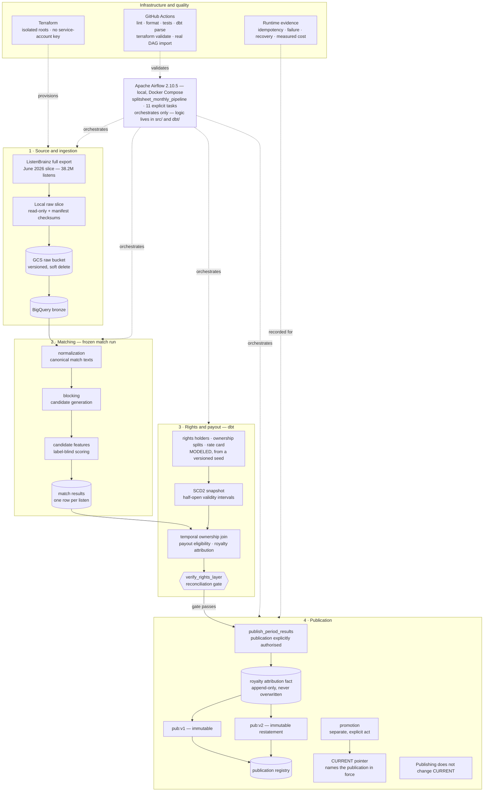

# SplitSheet

A royalty attribution pipeline built to be defensible rather than impressive: every number in
this repository is measured, versioned, and reported with the reason it might be wrong.

## Data provenance — read this before any figure

| what | status |
|---|---|
| **ListenBrainz listens** (2026-06 slice, 38,199,641 rows) | **REAL** — preserved, checksummed, immutable |
| **MusicBrainz canonical recordings** (snapshot 2026-07-17, 31,554,198 rows) | **REAL** |
| **ListenBrainz mapper recording MBID** | **REAL**, but a *correlated reference label*, not ground truth. Never an input to matching; evaluation only |
| **rights holders** | **MODELED** — generated from a versioned seed. No real company, label, publisher, writer or performer |
| **ownership splits** | **MODELED** — no real agreement, contract or share |
| **rate cards** | **MODELED** — *illustrative modeled rates*. Not a Spotify, Apple, Amazon or any other DSP rate; not an industry average; not observed |
| **any royalty amount** | **illustrative modeled amount, never an observed industry payout** |

The modeled declaration travels with the data, not only with this table: every generated row
carries an `is_modeled` column that is always `TRUE`, every dbt source and model description
repeats it, and `config/rights_model.yml` states it at the top of the generation contract.

Holder display names are of the form `Modeled Rights Holder 000042` **by construction**, so no
generated string can coincide with a real organisation.

## Two principles the code enforces

**A technical match is not an authorisation to pay.** `MATCHED != PAYABLE`. Payout eligibility is
a separate layer (`dbt/models/intermediate/int_payout_eligibility.sql`) applied *downstream* of an
unchanged match result. The 35,007 listens matched through the fallback path are held with
`hold_reason = MATCH_RISK_POLICY`, because that path disagreed with the reference label on 3.21%
of the validation partition against 0.0055% for structural acceptance, and no approved business
risk policy exists that would justify paying on it.

**Paying the wrong rights holder is worse than suspending payment.** Ambiguity is refused, never
resolved by convenience: a listen with two equally scored candidates becomes `AMBIGUOUS_TIE` with
no MBID, and a recording-day covered by two valid ownership sets becomes `MULTIPLE_VALID_SETS`
with no owner. There is no `ANY_VALUE`, no arbitrary `MIN` and no `ROW_NUMBER() = 1` deciding
either question.

## Architecture



## Where things are

```
config/     versioned, digest-sealed contracts: normalization, scoring, evaluation split,
            rights model, and the Phase 4B freeze manifest
src/        Python: extraction, normalization, blocking, features, scoring, evaluation, rights
dbt/        the warehouse: staging, payout eligibility, temporal ownership, SCD2 snapshot,
            data quality report
terraform/  six isolated roots; no service-account key exists anywhere in the project
docs/       schema_notes.md (the measurement log), cost.md, runbook.md,
            restatement_candidates.md, and phase0/*.json evidence artifacts
tests/      unit (pure, no cloud) and integration (real BigQuery, marked and separated)
```

## Current state

SplitSheet is now complete through Phase 7 of the project plan.

The June 2026 pipeline works on 38.2 million in-period ListenBrainz listens and covers the full path
from raw ingestion and identity resolution through rights attribution, modeled royalty calculation,
restatement, orchestration, and immutable publication.

The Airflow DAG has 11 explicit tasks. I validated every task against the real project state,
including reruns, failure handling, recovery, rights reconciliation, and publication safety. The
automated CI pipeline is green and covers Python formatting and linting, Python tests, `dbt parse`,
Terraform checks, and a real Airflow DAG import; `dbt compile` is validated separately in the
credentialed WIF integration workflow.

One important qualification: I proved the orchestration task by task with controlled runtime
evidence rather than claiming a single uninterrupted end-to-end DAG run. I prefer keeping that
distinction explicit instead of presenting stronger evidence than I actually collected.

The Phase 4B matcher and the Phase 5B financial publication are **frozen**
(`config/frozen_versions.yml`): 82.72% of listens carry a technical match, measured at 0.0066%
disagreement with the reference label on a validation partition opened exactly once.

Every published amount is an *illustrative modeled amount*, the published total closes to the cent
against the sum of its parts, and the first publication is immutable.

**Phase 6 restated it, and the result is the most instructive number in the project.** Transliterating
Korean and Japanese titles (a change chosen by an unsupervised probe under criteria frozen beforehand)
meant **570,735 listens became newly matched under normalization v2** — including all 384,926 listens
of one recording that previously could not even be looked up. Of those, **228 became newly
attributable**, and the **modeled payout delta was \$0.86**. Those three quantities are deliberately
never collapsed into one: a technical match, a payable listen and a published amount are different
claims, and nothing here was *recovered*. Two reasons, both of them the pipeline being right: the
modeled rights universe was generated against the *old* match run, so 26,665 of the 26,700 newly
matched recordings have no ownership record and are correctly refused; and cent rounding at the
published grain leaves small newly attributable amounts at \$0.00. Fixing matching does not produce
payouts on its own. Both publications remain queryable, v1's content digest is unchanged, and
`SUM(delta)` reconciles to the difference between them exactly.

**Every restatement is identified by what it touched, not only by which versions it ran under.**
`restatement_run_id` is a SHA-256 over canonical inputs that include the *cohort definition* — a
structured predicate in `config/restatement_cohorts.yml`, never prose and never a SQL string. The
first Phase 6 identifier hashed the versions alone, so the cohort that was built and rejected
(1,377,862 listens) and the cohort that was published (982,322) shared one id. That identifier is
preserved as legacy/insufficient rather than rewritten onto the 5.9M published rows:
`dbt/models/finance/restatement_run_registry.sql` maps it to the canonical identity of each run.

Every phase is written up in `docs/schema_notes.md`, including the measurements that contradicted
my own expectations. `docs/restatement_candidates.md` records the changes known to be worth making
and deliberately not made yet, with the evidence captured at the moment they were deferred.

## Orchestration and reliability

I added Airflow late in the project on purpose. The transformation and business logic already lived
in Python, SQL, and dbt, so Airflow's job is orchestration rather than becoming another place where
logic is hidden.

The monthly pipeline runs as 11 visible tasks under local Airflow 2.10.5 in Docker Compose.
Dependencies, parameters, logical dates, retries, run metadata, and recovery behavior are explicit.

A major focus of this phase was rerun safety. Several expensive stages now recognize when their
expected output already exists and is still valid, so a rerun can stop at a cheap validation path
instead of rewriting the same data. This mattered more to me than simply making the DAG "run",
because a pipeline that works once but is unsafe or unnecessarily expensive to rerun is not
operationally convincing.

Earlier in the project, I deliberately injected a failure before publication in the bronze loader
and verified that the target tables remained unchanged. During the orchestration phase, a separate
real publication-path failure exposed a restatement/configuration mismatch; I used the recovery path
to restore the affected dbt state and then fixed the publication rerun behavior rather than hiding
the failure. Those cases became part of the evidence for the recovery model instead of being treated
as noise.

## Publication model

Publication is intentionally separate from calculation.

A successful calculation produces an attribution result, but published results are versioned and
immutable. The project currently has `pub:v1` and `pub:v2`; `pub:v2` is a restatement rather than an
overwrite of `pub:v1`.

That distinction became important during Phase 7. I found that publication and pointer promotion
were too tightly coupled: under the wrong configuration, a scheduled publication could have moved
`CURRENT` back to an older valid publication. I changed the contract so that publishing does not
imply promotion. Moving `CURRENT` is now a separate, explicit action.

Rerunning an already valid publication is also handled as validation/no-op rather than as an excuse
to rebuild or overwrite it. This keeps the published history reproducible while still allowing
corrected versions to exist side by side.

For the June 2026 evidence:

- `pub:v1`: 5,925,913 rows, modeled paid amount of 98,284.22
- `pub:v2`: 5,925,923 rows, modeled paid amount of 98,285.08
- restatement delta: 0.86
- `CURRENT` points to the `pub:v2` attribution identity

These are modeled royalty outputs, not real royalty payments or revenue.

## What the numbers mean

The matching stage reaches about 82.72% of the June listening corpus, but I intentionally do not
treat "matched" and "payable" as synonyms.

Only about 74.31% of listens are payout-attributable under the modeled policy. The difference comes
from separate causes such as unmatched listens, missing rate-card coverage, match-risk policy, and
defective ownership data.

That separation is important to the project. A high-confidence recording match does not
automatically mean that the system has enough rights and policy information to produce a defensible
payout attribution.

The Phase 5B waterfall for the 38,199,641 in-period listens is:

- attributable: 28,386,887
- unmatched: 6,601,112
- rate-card gap: 3,164,839
- match-risk policy: 35,007
- defective ownership: 11,796
- rate-card ambiguous: 0

I prefer exposing those categories instead of collapsing them into a single success percentage.

## Limitations

This is a portfolio data-engineering system, not a production royalty platform.

The source is ListenBrainz, so the listening data should not be interpreted as commercial streaming
consumption. The royalty amounts are modeled from versioned seed data and policies; they are not
statements of real revenue, contracts, or payments.

Matching is intentionally imperfect. Some fallback matches have known residual disagreement risk,
and I keep that risk visible instead of treating every accepted match as equally strong.

The rights universe is also frozen for the modeled period. That became visible during the
restatement work: normalization improvements created many newly matched listens, but most of them
were outside the frozen rights universe, so the resulting payout change was only 0.86. I kept that
result instead of regenerating rights data just to manufacture a larger financial effect.

Duration/playtime coverage in the source export is not strong enough to support every time-based
analysis I originally considered.

The orchestration evidence is task-level rather than one single uninterrupted DAG run. Every task
has runtime evidence and the recovery/idempotency behavior was exercised, but I do not describe that
as a fully demonstrated production deployment.

There are also deliberate scope boundaries. There is no streaming layer, API, dashboard, Kubernetes
platform, managed Airflow deployment, or production IAM design here. Those would increase the amount
of technology in the repository without improving the questions this project is meant to answer.

## Trade-offs

I tried to make technology choices based on the workload rather than on how impressive the
architecture diagram would look.

I did not use Spark because the measured blocking candidate set and the rest of the workload were
manageable with Python, SQL, and BigQuery. I did not add Kafka or another streaming system because
the project is a monthly batch royalty workflow, not a low-latency event-processing problem.

Airflow runs locally in Docker Compose instead of Cloud Composer. Composer would be a reasonable
production option, but for this project it would add recurring cost and infrastructure work without
changing the orchestration concepts I wanted to demonstrate.

I used Terraform for the GCP resources where infrastructure reproducibility mattered, while keeping
the orchestration environment local. That makes the boundary explicit: cloud data infrastructure is
provisioned, but the portfolio project does not pretend to be a fully managed production platform.

I also chose immutable publication and explicit pointer promotion over a simpler overwrite model.
That added some implementation work, but it made restatements, auditability, rollback reasoning, and
reruns much clearer.

The same reasoning drove the idempotency guards. Some of the expensive stages can avoid most of
their original scan/rebuild work when the expected result is already present and valid. The point
was not to optimize every query; it was to make repeated execution predictable enough that rerunning
the pipeline is an operational action rather than a gamble.

## What I learned

The hardest parts of this project were not writing SQL or wiring tools together. They were deciding
what evidence was strong enough to trust a result.

Several useful problems only appeared after the first implementation looked "done": a normalization
rerun that could change historical bytes, a blocking schema assumption that was wrong, a mounted
runtime file that did not match the host copy, a rights verification task that reported failures
without actually failing, and a publication path that could have promoted the wrong version.

Fixing those changed how I think about data pipelines. Correct output is only one part of the job. I
also want to know what happens on the second run, what state is left after a failure, which inputs
are frozen, which outputs are immutable, and what evidence tells me that a rerun did not silently
change something important.

That is the part of SplitSheet I consider most representative of the project.

## Running it

Everything is driven by `make`. `make verify` is the pre-commit gate (ruff, unit tests, terraform
fmt, terraform validate) and prints every exit code, because a killed process must never look like
a pass. See `docs/runbook.md` for the phase-by-phase order and for what must not be re-run.
