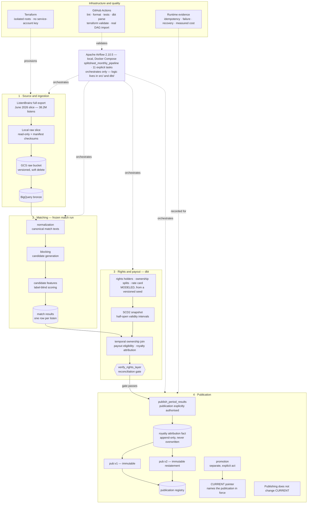

# SplitSheet

A royalty attribution pipeline built to be defensible rather than impressive: every number in
this repository is measured, versioned, and reported with the reason it might be wrong.

## Data provenance — read this before any figure

| what | status |
|---|---|
| **ListenBrainz listens** (2026-06 slice, 38,199,641 rows) | **REAL** — preserved, checksummed, immutable |
| **MusicBrainz canonical recordings** (snapshot 2026-07-17, 31,554,198 rows) | **REAL** |
| **ListenBrainz mapper recording MBID** | **REAL**, but a *correlated reference label*, not ground truth. Never an input to matching; evaluation only |
| **rights holders** | **MODELED** — generated from a versioned seed. No real company, label, publisher, writer or performer |
| **ownership splits** | **MODELED** — no real agreement, contract or share |
| **rate cards** | **MODELED** — *illustrative modeled rates*. Not a Spotify, Apple, Amazon or any other DSP rate; not an industry average; not observed |
| **any royalty amount** | **illustrative modeled amount, never an observed industry payout** |

The modeled declaration travels with the data, not only with this table: every generated row
carries an `is_modeled` column that is always `TRUE`, every dbt source and model description
repeats it, and `config/rights_model.yml` states it at the top of the generation contract.

Holder display names are of the form `Modeled Rights Holder 000042` **by construction**, so no
generated string can coincide with a real organisation.

## Two principles the code enforces

**A technical match is not an authorisation to pay.** `MATCHED != PAYABLE`. Payout eligibility is
a separate layer (`dbt/models/intermediate/int_payout_eligibility.sql`) applied *downstream* of an
unchanged match result. The 35,007 listens matched through the fallback path are held with
`hold_reason = MATCH_RISK_POLICY`, because that path disagreed with the reference label on 3.21%
of the validation partition against 0.0055% for structural acceptance, and no approved business
risk policy exists that would justify paying on it.

**Paying the wrong rights holder is worse than suspending payment.** Ambiguity is refused, never
resolved by convenience: a listen with two equally scored candidates becomes `AMBIGUOUS_TIE` with
no MBID, and a recording-day covered by two valid ownership sets becomes `MULTIPLE_VALID_SETS`
with no owner. There is no `ANY_VALUE`, no arbitrary `MIN` and no `ROW_NUMBER() = 1` deciding
either question.

## Architecture



## Where things are

```
config/     versioned, digest-sealed contracts: normalization, scoring, evaluation split,
            rights model, and the Phase 4B freeze manifest
src/        Python: extraction, normalization, blocking, features, scoring, evaluation, rights
dbt/        the warehouse: staging, payout eligibility, temporal ownership, SCD2 snapshot,
            data quality report
terraform/  six isolated roots; no service-account key exists anywhere in the project
docs/       schema_notes.md (the measurement log), cost.md, runbook.md,
            restatement_candidates.md, and phase0/*.json evidence artifacts
tests/      unit (pure, no cloud) and integration (real BigQuery, marked and separated)
```

## Current state

Phases 0 through 6 are complete. The Phase 4B matcher and the Phase 5B financial publication are
**frozen** (`config/frozen_versions.yml`): 82.72% of listens
carry a technical match, measured at 0.0066% disagreement with the reference label on a validation
partition opened exactly once. Phase 5A added modeled rights, temporal ownership with half-open
validity intervals, a real dbt SCD2 snapshot over rights holders, and a queryable data quality
report. Phase 5B added the payout policy, royalty attribution and an immutable financial
publication.

**The number that matters is not the match rate.** Under the v1 publication 82.72% of listens are
technically matched and **74.31% are payable**: the difference is 3.16M streams whose rate card has a
deliberate gap, 35,007 held because the fallback match path is not trusted enough to pay on, and 11,796
with defective ownership. Every published amount is an *illustrative modeled amount*, the published
total closes to the cent against the sum of its parts, and the first publication is immutable.

**Phase 6 restated it, and the result is the most instructive number in the project.** Transliterating
Korean and Japanese titles (a change chosen by an unsupervised probe under criteria frozen beforehand)
meant **570,735 listens became newly matched under normalization v2** — including all 384,926 listens
of one recording that previously could not even be looked up. Of those, **228 became newly
attributable**, and the **modeled payout delta was \$0.86**. Those three quantities are deliberately
never collapsed into one: a technical match, a payable listen and a published amount are different
claims, and nothing here was *recovered*. Two reasons, both of them the pipeline being right: the
modeled rights universe was generated against the *old* match run, so 26,665 of the 26,700 newly
matched recordings have no ownership record and are correctly refused; and cent rounding at the
published grain leaves small newly attributable amounts at \$0.00. Fixing matching does not produce
payouts on its own. Both publications remain queryable, v1's content digest is unchanged, and
`SUM(delta)` reconciles to the difference between them exactly.

**Every restatement is identified by what it touched, not only by which versions it ran under.**
`restatement_run_id` is a SHA-256 over canonical inputs that include the *cohort definition* — a
structured predicate in `config/restatement_cohorts.yml`, never prose and never a SQL string. The
first Phase 6 identifier hashed the versions alone, so the cohort that was built and rejected
(1,377,862 listens) and the cohort that was published (982,322) shared one id. That identifier is
preserved as legacy/insufficient rather than rewritten onto the 5.9M published rows:
`dbt/models/finance/restatement_run_registry.sql` maps it to the canonical identity of each run.

Every phase is written up in `docs/schema_notes.md`, including the measurements that contradicted
my own expectations. `docs/restatement_candidates.md` records the changes known to be worth making
and deliberately not made yet, with the evidence captured at the moment they were deferred.

## Running it

Everything is driven by `make`. `make verify` is the pre-commit gate (ruff, unit tests, terraform
fmt, terraform validate) and prints every exit code, because a killed process must never look like
a pass. See `docs/runbook.md` for the phase-by-phase order and for what must not be re-run.
